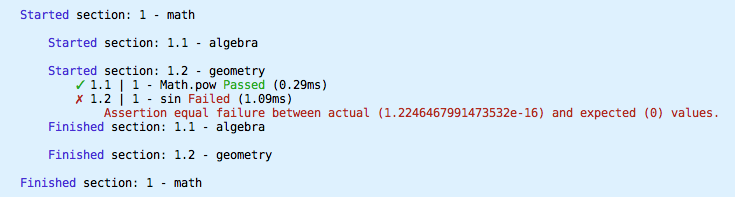
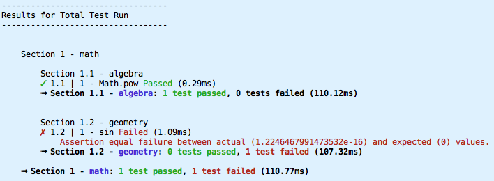
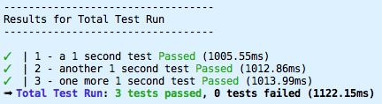
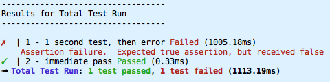
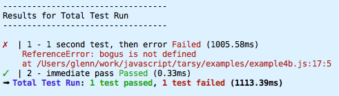

# Tarsy 🐒

Tarsy is a JavaScript test framework that focuses on simplicity, accuracy, and efficiency. It is the little test framework with **BIG EYES** for hunting bugs - It is *JavaScript testing for busy people.*

## Key Features

- Single file; no dependencies; no "installation" simplicity
- Not only supports promises and asynchronicity, its fully asynchronous itself
- Runs your tests simultaneously ensuring blistering fast test runs
- Works in both Node and in the browser
- High resolution timing (to 1/100 ms)
- Has command line "test runner" utility to easily run/script testing
- Simple API - learn in 10 minutes
- Easy to integrate with CI (continuous integration) services
- Supports running some (or all) tests synchronously if required
- Simple `equal` asserts. No `assert.that.variable(foo).is.less.than(25)` stuff to memorize
- Makes no attempts to be "smart" or "tricky" and inspect your calls for information - you can use Tarsy with any code constructs you wish (such as `[].map(test)`, etc.

-----------------

***Nothing gets by this little guy!***


This is a *tarsier* - he is able to hunt  in light levels between 0.001 and 0.01 lux. What does he hunt? **Bugs** of course!

----------

## Table of Contents

  - [Introduction](#introduction)
  - [Download](#download)
  - [Installation / Incorporation](#installation--incorporation)
  - [Usage](#usage)
    - [A complete minimal example:](#a-complete-minimal-example)
    - [Example with sections and multiple tests](#example-with-sections-and-multiple-tests)
    - [Asynchronicity](#asynchronicity)
  - [API Reference](#api-reference)
    - [`assert(bool)`](#assertbool)
    - [`assert.equal(actual,expected)`](#assertequalactualexpected)
    - [`assert.deepEqual(actual, expected)`](#assertdeepequalactual-expected)
    - [`assert.notDeepEqual(actual, expected)`](#assertnotdeepequalactual-expected)
    - [`assert.throws(fn)`](#assertthrowsfn)
    - [`assert.rejects(fn)`](#assertrejectsfn)
    - [`getFailCount()`](#getfailcount)
    - [`getPassFailCount([section])`](#getpassfailcountsection)
    - [`section(name,fn,[opts])`](#sectionnamefnopts)
    - [`setRootOpts(opts)`](#setrootoptsopts)
    - [`showResults([section])`](#showresultssection)
    - [`test(name,fn,[opts])`](#testnamefnopts)
    - [`waitForCompletion()`](#waitforcompletion)
  - [options](#options)


## Introduction

**Tarsy** is a minimalist testing framework that is super simple to build (no dependencies), easy to incorporate (single file, works in browser and node) and use (built-in asserts, minimal API). It is super fast, with an async-first approach - and not only supports Promises, but is woven together with them.

With **Tarsy**, there are no custom report formats, no assert library plugins and essentially no learning curve.

Spend ***less*** time messing with your testing framework, and ***more*** time writing *better tests*, working on *product features*, or maybe doing something ***outdoors!***

## Download

This project is called **tarsy** on github, npm and bower. There are no dependencies, so downloading is fast, easy and simple.

### Installing the `tarsy` command

There is an optional `tarsy` command which you can run against a test file (or test directory). It is a very simple command script which makes `Tarsy`, `assert`, `section` and `test` functions global and then runs your script.

```bash
npm install -g tarsy
```

### Installing into an NPM project (node/browserify/etc)

Generally testing tools (such as **Tarsy**) are considered a development dependency, which means they appear in the `package.json` in the `devDependencies` section and are only installed in development mode.

So install into your project, like this:

```bash
npm install --save-dev tarsy
```

### bower
```bash
bower install tarsy
```

### DIY

All you need is a single file, so just grab the zip from github, or even just the single tarsy.js file.


## Installation / Incorporation

**Tarsy** is exceedingly simple to incorporate into your project. It is a single file with no dependencies for both *browser* and *Node*. It is even the **same** single file.

### Browser

For the browser, you can download in any way you like (using NPM, bower, git, download the zip, or even copy-paste from the *src/tarsy.js* file), then, you can either include it in a `script` element:

```html
<script src="path-to-tarsy/tarsy.js"> </script>
<!-- Tarsy is now defined globally -->
```

or use an AMD module loader, such as require.js:

```javascript
require(["tarsy"], function(Tarsy) {

	// Tarsy is now available...

})
```

### Node (and NPM-based browser module systems like browserify)
```javascript
var Tarsy = require("tarsy")
```

## Usage

The API is composed of 3 key functions: `section`, `test` and `assert`.

`section` is for logically dividing up your tests into sections. They may be nested to any level and may contain options that override their parent.

`test` is used to define a single test.

`assert` is for identifying each expected condition. Used on its own, it asserts a condition which is expected to be true.

### A complete minimal example:

```javascript
	Tarsy.test("simple addition", function() {
			Tarsy.assert(1 + 1 === 2)
		})
```

Thats it - a fully functional test! No setup or configuration or initialization needed.


Running that in Node (with the extra `require` line) produces the following output:


You simply get an output line for each test with its status and a time elapsed.

### Example with sections and multiple tests

You can divide your tests in to multiple sections for clarity. These sections can contain sections themselves by nesting the section calls. You can nest as deeply as you like.

```javascript
var Tarsy = require("./src/tarsy.js")

// For larger examples, its best to define these oft-used functions
var assert = Tarsy.assert,
    test = Tarsy.test,
    section = Tarsy.section

section("math", function() {
	section("algebra", function() {
			test("Math.pow", function() {
					assert.equal(Math.pow(3,3),27)
				})
		})

	section("geometry", function() {
		// geometry testing goes here
		test("sin", function() {
			assert.equal(Math.sin(0),0)
			assert.equal(Math.sin(Math.PI / 2),1)
		})
	})
})
```

Running this with node results in:



Section starts and ends are noted as they occur, along with the results of each test. Oooh, notice a failure in the *sin* test due to precision - **sin(π) ≠ 0** in ECMA land.

You may have also noticed the ordering - the **geometry** section started before the **algebra** section finished. This is due to the inherit asynchronous nature of **Tarsy**.

This makes your tests as fast as possible. Life is too short to wait for tests to complete!

But it can make your results harder to see, so there is a handy function which restates your results in a nice orderly report format:

```javascript
Tarsy.showResults()
```

Placing this statement at the end of the above example, appends the following to the output:



Lets explore the asynchronous nature a bit more:

### Asynchronicity

**Tarsy** is intrinsically asynchronous. All tests return a promise which is resolved when the test completes. Each section also returns a promise that resolves when all tests within that section completes.

Tests can execute asynchronous code as well - just have your test return a promise. If that promise resolves to a non-error value (before the timeout), the test will pass.

**Quiz**: How long do you think the following set of tests will take to complete?

```javascript
	Tarsy.test("a 1 second test", function() {
			return delayPromise(1000) // completes in 1 second
		})
	Tarsy.test("another 1 second test", function() {
			return delayPromise(1000) // completes in 1 second
		})
	Tarsy.test("one more 1 second test", function() {
			return delayPromise(1000) // completes in 1 second
		})
```

If you said "about 3 seconds" then you aren't thinking asynchronously enough! This set of tests finishes in just over 1 second - since all 3 tests are run simultaneously.




**NOTE:** There are two common arguments against running tests asynchronously, and in fact other test frameworks tout synchronous tests as a feature - but **Tarsy** has a solution for each issue:

#### Problem 1: Sometimes tests depend on the completion of test before it.

This is a [testing anti-pattern](http://blog.james-carr.org/2006/11/03/tdd-anti-patterns/) and should be avoided if possible. But if you wish to do so, there are a few ways to force synchronous running of a single test or a group of tests. For example, *test2* below waits for *test1* to complete:

```javascript
test("test1", function() {
		// test1 test....
	}).then(function() { // wait for this test to complete...

	test("test2", function() {
			// test2 code here!
		})
})
```

or, force an entire section to run its tests synchronously:

```javascript
section("sync tests", function() {

	test("test1", function() {
			// test1 test....
		})

	test("test2", function() {
			// test2 code here!
		})

}, {
	async: false	// Forces all tests in this section to be synchronous
})
```

#### Problem 2: Errors occurring in asynchronous code are not tied to their test

This is true in some cases with some testing frameworks, but promises essentially eliminate the problem entirely. For example:

```javascript
test("1 second test, then error", function() {
		return delayPromise(1000).then(function() {
				assert(false)
			})
	})

test("immediate pass", function() {
		assert(true)
	})
```
When running the above tests in the default asynchronous mode, the 2nd "immediate pass" test finishes first, while the 1st test delays for a second and then fails an assert. The error is propagated to the enclosing promise and fails the appropriate test:



And it isn't just asserts, but any error thrown will get caught:

```javascript
test("1 second test, then error", function() {
		return delayPromise(1000).then(function() {
				bogus.foo = "bar" // this will throw an error
			})
	})

test("immediate pass", function() {
		assert(true)
	})
```

output:



## API Reference

The following are all properties of the **Tarsy** object:

- [`assert(bool)`](#assertbool)
- [`assert.equal(actual,expected)`](#assertequalactualexpected)
- [`assert.deepEqual(actual, expected)`](#assertdeepequalactual-expected)
- [`assert.notDeepEqual(actual, expected)`](#assertnotdeepequalactual-expected)
- [`assert.throws(fn)`](#assertthrowsfn)
- [`assert.rejects(fn)`](#assertrejectsfn)
- [`getFailCount()`](#getfailcount)
- [`getPassFailCount([section])`](#getpassfailcountsection)
- [`section(name,fn,[opts])`](#sectionnamefnopts)
- [`setRootOpts(opts)`](#setrootoptsopts)
- [`showResults([section])`](#showresultssection)
- [`test(name,fn,[opts])`](#testnamefnopts)
- [`waitForCompletion()`](#waitforcompletion)

### `assert(bool)`

If the passed boolean is anything other than `true`, the assertion fails and an error is thrown.

**Note:** Tarsy is deliberately picky. The passed value is strictly compared to `true`. *"Truthy"* is not true enough. This behavior is **in contrast** to the standard [Node assert.ok](https://nodejs.org/api/assert.html) and most assert libraries, see [QUnit](https://api.qunitjs.com/ok/) or [Chai](http://chaijs.com/api/assert/) for example) which passes *truthy* values.

#### In Node (and most other testing frameworks):

```javascript
assert("false")	// no error is thrown
assert(100)	// no error
assert(Error("bad value")) // this gets a pass
assert(1/0)  // Infinity is truthy, so no error here either
```

All of the above **will throw an error** with Tarsy. This is a much safer approach, since Javascript is not strictly typed and errors involving auto-coaxing are common. If you wish to check **truthy** style, you can compare to `true` using `==` such as:

```javascript
Tarsy.assert(100 == true) // No error is thrown
```

or use the somewhat cryptic *double bang* notation:

```javascript
Tarsy.assert(!!100) // No error is thrown
```

But don't do this. Write your APIs with well defined outputs and test them with strict equality. Tarsy helps you do this with its default behavior.

### `assert.equal(actual,expected)`

This compares two values in a strict fashion (i.e. using `===`).

Generally you generate the first argument (the `actual` value) from calls to your API, then explicitly state the second argument (the `expected` value), as such:

```javascript
Tarsy.assert.equal(Math.pow(2,3),8)
```

Again, keep in mind this strict equality test differs from most assert libraries which allow type coercion:

```javascript
var assert = Tarsy.assert
assert.equal(1,1)				// This passes of course
assert.equal(1,"1")				// This does not pass
assert.equal(null,undefined)	// this assert fails as well
assert.equal({a:1},{a:1})		// this fails since these are two different objects (see deepEqual)
```

Most assert libraries will pass all but the last one of the above examples. Other libraries may offer an `assert.strictEqual`. I feel this should be the default. If you want to test equality with coercion, you can always do:

```javascript
Tarsy.assert(Math.pow(2,3) == "8")  // this works, but why would you do this??
```

### `assert.deepEqual(actual, expected)`

Same as `assert.equal` for primitive types. For `object` types (which includes Arrays) each item or property within the two objects to see if they are strictly equal (or if they are also objects, their properties are compared). This allows the comparison of two separately generated objects to be compared for expected results.

#### Examples:

```javascript
var assert = Tarsy.assert
assert.deepEqual({a:1},{a:1})				// This passes
assert.deepEqual({a:1},{a:1,b:2})			// This fails
assert.deepEqual([1,2,3,4],[1,2,3,4])	// passes
assert.deepEqual([1,2,3,4],[4,3,2,1])	// fails (item order in arrays is important)
assert.deepEqual({a:1,b:2},{b:2,a:1})	// passes (object properties have no "order")
```

### `assert.notDeepEqual(actual, expected)`

Inverse of `deepEqual` above.

```javascript
var assert = Tarsy.assert
assert.notDeepEqual({a:1},{a:1})			// This fails
assert.notDeepEqual({a:1},{a:1,b:2})		// This passes
assert.notDeepEqual([1,2,3,4],[1,2,3,4])	// fails
assert.notDeepEqual([1,2,3,4],[4,3,2,1])	// passes (item order in arrays is important)
assert.notDeepEqual({a:1,b:2},{b:2,a:1})	// fails (object properties have no "order")
```

### `assert.throws(fn)`

This assertion **fails** if the passed function **does not** throw an error. This is useful for testing your API for erroneous conditions.

```javascript
var assert = Tarsy.assert

// These assertions all pass because they all throw errors
assert.throws(function() {
		var c = Math.double(3)	// Math.double is not a function
	})
assert.throws(function() {
		bogus.foo = "bar"		// bogus variable does not exist
	})
assert.throws(function() {
		speedUp					// pretty sure this command doesn't exist in javascript
	})
```

### `assert.rejects(fn)`

This assert passes when the function specified **returns a promise** and **that promise is rejected**.

This is useful for testing expected errors within asynchronous code. It is different from the others in that it also returns a promise that will resolve if the assert passes and reject if the assert fails.

The test function within which this assert appears must also return a promise and pass on the resolve/reject status of this assert. The easiest way to do this is to simply return the result from this assert as the last statement of your test:

```javascript
test("Reading Network Resource", function() {

		// You could have other synchronous asserts here... but only one
		// asserts.rejects per test using this style.

		// This test will succeed, as the following assert will pass
		return assert.rejects(function() {
				// the following will reject with an "Unknown URL" error
				return network.read("http://bogus.example.com/data.json")
			})
	})
```


### `getFailCount()`

Returns the current number of failed tests.

Keep in mind that **Tarsy** runs tests asynchronously, so if you wish to determine the total number of tests that fail in your test script, you need to wait for it to finish:

```javascript

// Place all your tests above this code section

Tarsy.waitForCompletion()
	.then(function() {
			console.log("We failed " + Tarsy.getFailCount() + " tests.")
		})
```

### `getPassFailCount([section])`

Returns an object with the current number of test passes (`pass` property) and test fails (`fail` property) for the specified `section` (or for all tests if `section` argument is omitted).

Due to asynchronous nature of **Tarsy**, you must wait until the relevant tests complete before calling this function.

#### Example:

```javascript

// ... bunch of tests ...

Tarsy.waitForCompletion()
	.then(function() {
			var passFail = Tarsy.getPassFailCount()
			console.log("pass count: " + passFail.pass + ", fail count: " + passFail.fail)
		})
```

### `section(name,fn,[opts])`

This is the function to call when defining a testing section. You must give it a name (which is used in reporting) and a function which contains all the tests and subsection calls for this section.

The optional `opts` argument is a set of options that override parent options and are in effect for this section only. See the full list of config options below.

#### Example:

```javascript
var section = Tarsy.section

section("user", function() {

		// user tests can go here

		section("user avatar", function() {

				// Test user avatar code here

			}, { async: false}) // run all avatar tests synchronously

		// More user subsections can be defined here

		// Any tests defined here are still part of the *user* section

	})

// More top-level sections can be defined here

```

### `setRootOpts(opts)`

Sets the config options that apply to all sections and all tests unless they are overridden at the section or test level.

Generally you would call this function before defining any sections or tests, though that is not strictly enforced. If you want to change options after defining some tests, create a new section via the `section` function and specify option overrides for that section.

For a list of available options, see the options section below.

#### Example

```javascript
Tarsy.setRootOpts({
		async: false,
		timeout: 8000
	})
```

### `showResults([section])`

Displays the standard report for either the specified `section` or for all tests. This function first waits for all tests contained within the section being reported to finish.

**Note:** Since the `section` function returns a promise that resolves with that sections' object, you can use the promise to obtain a handle on that section and pass it to showResults if desired:

```javascript
section("user", function() {
	// user tests here
}).then(Tarsy.showResults) // this displays results only for this section when it completes
```

### `test(name,fn,[opts])`

Call this function to define each of your tests. The `name` is used in reporting and should be unique (though that is not enforced). The `fn` is a function that contains the test code, including the asserts that ensure you code is working as expected.

The optional `opts` contains option overrides for this test. See the full list of config options below.

#### Example:

```javascript
var test = Tarsy.test	// for convenience

test("addition", function() {
	assert.equal(2 + 3,5)
	assert.equal(-8 + 4,-4)
})
```

### `waitForCompletion()`

Returns a promise that resolves when all tests have completed. Useful when wanting to return a pass/fail count for example. (See `getPassFailCount()` above)

#### Example:

```javascript

// bunch-o-Tests go here

Tarsy
	.waitForCompletion()
	.then(function() {
			// All tests are done at this point
			process.exit(Tarsy.getFailCount() ? 1 : 0) // return status of 0 for all tests passed, 1 for errors
		})

```

### options

The following options are set via the `Tarsy.setRootOpts` to effect the root settings, or for a specific `section` or `test` by passing them in as the third parameter.

| Option       | Description                                                     | Default |
| ------------ | --------------------------------------------------------------- | ------- |
| **timeout**  | Number of ms to wait for asynchronous tests to complete         | 5000    |
| **async**    | If false, each test will wait for the previous test to complete | true    |
